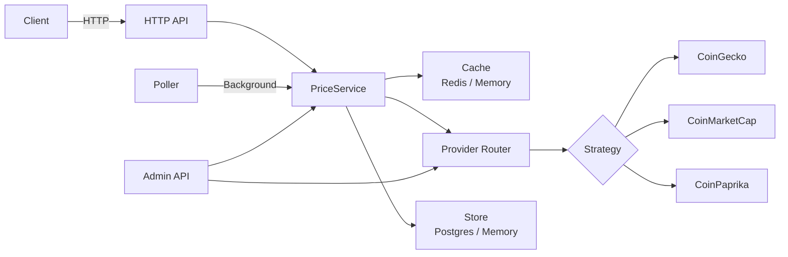

# Crypto Price Aggregator

[](https://github.com/spiehdid/crypto-price-aggregator/actions/workflows/ci.yml)
[](https://goreportcard.com/report/github.com/spiehdid/crypto-price-aggregator)
[](https://go.dev/)
[](LICENSE)
[]()
[]()
[]()
[](Dockerfile)

A Go microservice that aggregates cryptocurrency prices from **40+ free-tier APIs** with smart routing, consensus pricing, caching, and resilience. One binary, zero mandatory dependencies.

## Features

- **40+ price providers** — CoinGecko, Coinbase, Binance, Kraken, OKX, Bybit, and 34 more
- **Smart routing** — 3 strategies (weighted scoring, priority fallback, round-robin) with per-provider circuit breakers, rate limit tracking, and accuracy scoring
- **Price integrity** — 5-layer validation: basic checks, per-category deviation thresholds (stablecoin/major/alt), consensus pricing via median, outlier detection, provider reputation tracking
- **Pluggable storage** — PostgreSQL, Redis cache, ClickHouse analytics, in-memory fallback
- **Real-time** — Binance WebSocket streaming + WebSocket API for clients
- **Address lookup** — query by contract address + chain ID, auto-learning token registry (14,000+ tokens)
- **Analytics** — provider accuracy, price anomaly detection, volume distribution (ClickHouse)
- **Price alerts** — webhook notifications with retry, SSRF protection
- **Dashboard** — embedded web UI (Alpine.js + Tailwind + Chart.js)
- **Production-ready** — Docker, Kubernetes manifests, Prometheus metrics + alerts, OpenTelemetry, graceful shutdown, config validation, CORS, security headers

## Architecture



The service follows hexagonal architecture: the core domain (`internal/core`) defines ports (interfaces) for every external concern — providers, cache, store, and telemetry. Adapters in `internal/adapter/` provide the concrete implementations. This makes every infrastructure dependency swappable and independently testable without touching business logic.

## Quick Start

```bash
# Clone
git clone https://github.com/spiehdid/crypto-price-aggregator.git
cd crypto-price-aggregator

# Run with Docker (Postgres + Redis included)
docker-compose up

# Or run locally (in-memory mode, no external dependencies)
go run ./cmd/server/
```

```bash
# Health check
curl http://localhost:8080/healthz

# Fetch the current Bitcoin price
curl http://localhost:8080/api/v1/price/bitcoin

# List all providers and their current status
curl http://localhost:8080/api/v1/admin/providers
```

## API Examples

### Get Bitcoin Price
```bash
curl http://localhost:8080/api/v1/price/bitcoin?currency=usd
```

Response:
```json
{
  "coin": "bitcoin",
  "currency": "usd",
  "price": "67432.15",
  "provider": "coingecko",
  "cached": false,
  "timestamp": "2026-03-22T10:00:00Z"
}
```

### Get Multiple Prices
```bash
curl "http://localhost:8080/api/v1/prices?coins=bitcoin,ethereum,solana&currency=usd"
```

### Get Price by Contract Address
```bash
curl http://localhost:8080/api/v1/price/address/ethereum/0xdAC17F958D2ee523a2206206994597C13D831ec7
```

### Convert Crypto
```bash
curl "http://localhost:8080/api/v1/convert?from=bitcoin&to=ethereum&amount=1"
```

### OHLC Candles
```bash
curl "http://localhost:8080/api/v1/ohlc/bitcoin?currency=usd&from=2026-03-21T00:00:00Z&to=2026-03-22T00:00:00Z&interval=1h"
```

### Create Price Alert
```bash
curl -X POST http://localhost:8080/api/v1/alerts \
  -H "Content-Type: application/json" \
  -d '{"coin_id":"bitcoin","condition":"above","threshold":"70000","webhook_url":"https://hooks.example.com/btc-alert"}'
```

### Provider Status (Admin)
```bash
curl -H "X-API-Key: your-key" http://localhost:8080/api/v1/admin/providers
```

### System Stats (Admin)
```bash
curl -H "X-API-Key: your-key" http://localhost:8080/api/v1/admin/stats
```

## Configuration

The service is configured via `config/config.yaml`, with every value overridable through environment variables using the `CPA_` prefix (e.g. `CPA_SERVER_PORT=9090`).

| Variable | Default | Description |
|----------|---------|-------------|
| `CPA_SERVER_PORT` | `8080` | Port the HTTP server listens on |
| `CPA_STORAGE_POSTGRES_ENABLED` | `false` | Enable PostgreSQL for price history persistence |
| `CPA_STORAGE_POSTGRES_DSN` | _(empty)_ | PostgreSQL connection string |
| `CPA_STORAGE_REDIS_ENABLED` | `false` | Enable Redis for distributed caching |
| `CPA_STORAGE_REDIS_ADDR` | `localhost:6379` | Redis server address |
| `CPA_ROUTING_STRATEGY` | `smart` | Routing strategy: `smart`, `priority`, or `roundrobin` |
| `CPA_PRICING_CACHE_TTL` | `30s` | How long a cached price is considered fresh |
| `CPA_TELEMETRY_TRACES_ENABLED` | `false` | Enable OpenTelemetry trace export |
| `CPA_TELEMETRY_METRICS_ENABLED` | `false` | Enable OpenTelemetry metrics export |

## API Reference

| Method | Endpoint | Description |
|--------|----------|-------------|
| `GET` | `/healthz` | Liveness check — returns 200 if the server is running |
| `GET` | `/readyz` | Readiness check — verifies at least one provider is reachable |
| `GET` | `/api/v1/price/{coinID}` | Get the current price for a single coin |
| `GET` | `/api/v1/prices?coins=...` | Get prices for multiple coins in one request |
| `GET` | `/api/v1/admin/providers` | List all registered providers with circuit breaker and rate limit status |
| `GET` | `/api/v1/admin/subscriptions` | List all coins currently subscribed to background polling |
| `POST` | `/api/v1/admin/subscriptions` | Subscribe a coin to background polling |
| `DELETE` | `/api/v1/admin/subscriptions/{coinID}` | Unsubscribe a coin from background polling |

Example response for `GET /api/v1/price/bitcoin`:

```bash
curl http://localhost:8080/api/v1/price/bitcoin
```

```json
{
  "coin_id": "bitcoin",
  "symbol": "BTC",
  "price": "84231.57",
  "currency": "usd",
  "provider": "coingecko",
  "timestamp": "2026-03-21T10:15:03Z"
}
```

## Development

```bash
make build          # Build binary
make test           # Run tests
make test-race      # Run tests with race detector
make lint           # Run golangci-lint
make docker-up      # Start with Docker
make docker-down    # Stop Docker
```

### Adding a New Provider

1. Create an adapter in `internal/adapter/provider/<name>/` that implements the `port.PriceProvider` interface
2. Add a case to `createProvider()` in `cmd/server/main.go` to wire it up
3. Add a config section under `providers:` in `config/config.yaml` with the provider's base URL, API key, and weight

## Tech Stack

| Component | Library |
|-----------|---------|
| HTTP Router | `go-chi/chi` |
| Config | `spf13/viper` |
| PostgreSQL | `jackc/pgx v5` |
| Redis | `redis/go-redis v9` |
| Observability | OpenTelemetry |
| Decimal | `shopspring/decimal` |
| Mocks | `go.uber.org/mock` |
| Testing | `stretchr/testify` |
| Migrations | `golang-migrate` |

## License

MIT — see [LICENSE](LICENSE)
